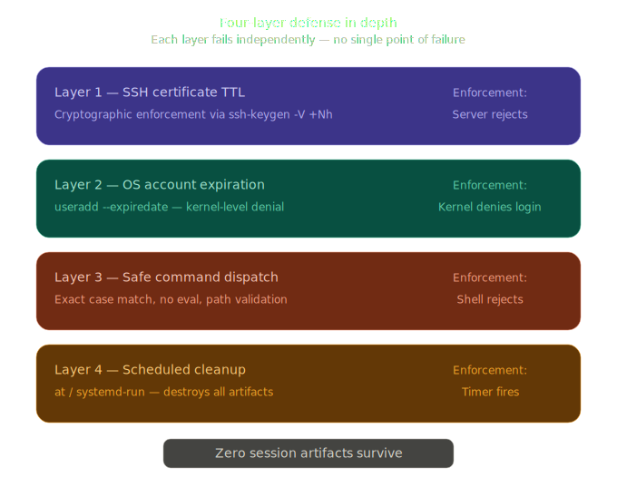

# sparkey

Time-limited, self-destructing SSH access for AI agents. Four-layer defense-in-depth: certificate TTL, OS account expiry, command-restricted dispatch, and automated cleanup. Zero credentials survive the session.

---

## Why

Static credentials cause persistent breaches. A leaked SSH key works identically on day one and five years later. This skill applies the temporary-credential pattern — the same principle behind AWS STS and short-lived OAuth tokens — to SSH access for AI agents:

- **Expires automatically** — cryptographic certificate TTL, not "remember to revoke"
- **Restricts commands** — read-only diagnostics by default, no full shell
- **Leaves nothing behind** — account, keys, and scripts destroyed after each session
- **Logs everything** — sanitized audit trail of every command

---

## How It Works

Four independent defense layers ensure no single failure leaves access open:

<picture>
  
</picture>

| Layer | Mechanism | Enforcement |
| ----- | --------- | ----------- |
| 1 | SSH Certificate TTL | Cryptographic — server rejects expired certs |
| 2 | OS Account Expiration | `useradd --expiredate` — kernel-level denial |
| 3 | Safe Command Dispatch | Exact match, path validation, no `eval` |
| 4 | Scheduled Cleanup | `at` or `systemd-run` — destroys all artifacts |

---

## Access Lifecycle

<picture>
  
</picture>

## Quick Start

**Agent-initiated (simplest):** The agent generates its own keypair and offers the public key. The user adds it to the target's `authorized_keys`. No scripts run on the target.

**CA-backed (strongest):** Layers certificate signing, command restriction, and scheduled cleanup for defense in depth. All scripts run on the operator's machine:

```bash
# One-time: create Certificate Authority
sudo bash scripts/setup-ca.sh

# Grant 4-hour diagnostic access (agent provides their pubkey)
sudo bash scripts/grant-access.sh \
  --host myserver.example.com \
  --duration 4h \
  --agent-pubkey /path/to/agent.pub

# Revoke immediately if needed
sudo bash scripts/revoke-access.sh --session SESSION_ID
```

---

## Command Profiles

| Profile | Access Level |
| ------- | ------------ |
| `diagnostic` (default) | Read-only: logs, status, metrics, network diagnostics |
| `remediation` | Diagnostic + service restarts, config edits, Docker management |
| `full` | Unrestricted shell (use with extreme caution) |

---

## Requirements

- **Linux** with standard user-management tools
- `openssh-client` (`ssh-keygen`)
- `at` or `systemd` (scheduled cleanup)
- Optional: `shred` (secure key deletion), `chattr` (immutable authorized\_keys)

Scripts check for missing tools at startup and report what to install:

```bash
# Debian/Ubuntu
sudo apt-get install -y openssh-client coreutils passwd at e2fsprogs procps

# Alpine
apk add openssh-keygen bash shadow coreutils util-linux procps at e2fsprogs

# RHEL/Fedora
sudo dnf install -y openssh-clients coreutils shadow-utils at e2fsprogs procps-ng
```

---

## Installation

### As a Claude Code Skill

```bash
git clone https://github.com/sanjeevneo/sparkey.git \
  ~/.claude/skills/sparkey
```

### From ClawHub

```bash
clawhub install sparkey
```

The SKILL.md file follows the [Agent Skills open standard](https://github.com/anthropics/skills/blob/main/spec/agent-skills-spec.md) and is compatible with Claude Code, OpenClaw, and other conforming tools.

---

## Security

- **No `eval`** — commands dispatched directly via `"$COMMAND" "${ARGS[@]}"`
- **No prefix matching** — exact command-name match via `case` statement
- **Shell metacharacters blocked** — `;` `|` `&` `$` and backticks rejected before parsing
- **Path-restricted arguments** — diagnostic profile limited to `/var/log/`, `/proc/`, `/sys/`, `/run/`, `/tmp/`
- **Sanitized audit logs** — `printf '%q'` prevents log injection
- **Session isolation** — each session gets its own dispatch shell and cleanup timer
- **Real-time observability** — agent creates a shared `screen`/`tmux` session the user can attach to
- **Minimal target footprint** — no scripts transferred; only public key material and dispatch shell deployed

See [SKILL.md](SKILL.md) for the full reference, including the Security Manifest and Trust & Privacy statement.

---

## License

MIT
